# Technical Design Document

> Generated by [`ZenStack-markdown`](https://github.com/jiashengguo/zenstack-markdown)

- [User](#User)
- [Client](#Client)
- [Company](#Company)
- [Site](#Site)
- [Appliance](#Appliance)
- [SettingsHistory](#SettingsHistory)
- [Vendor](#Vendor)
- [Category](#Category)
- [DeviceType](#DeviceType)
- [SensorType](#SensorType)
- [DeviceSensorMapping](#DeviceSensorMapping)
- [Device](#Device)
- [Sensor](#Sensor)
- [MeasureType](#MeasureType)
- [MeasureTypeAggregate](#MeasureTypeAggregate)
- [MeasureTypeAggregateAccessor](#MeasureTypeAggregateAccessor)
- [DefaultValueTypeAggregate](#DefaultValueTypeAggregate)
- [DefaultValueTypeAggregateAccessor](#DefaultValueTypeAggregateAccessor)
- [SensorMeasureMapping](#SensorMeasureMapping)
- [Measure](#Measure)

## User
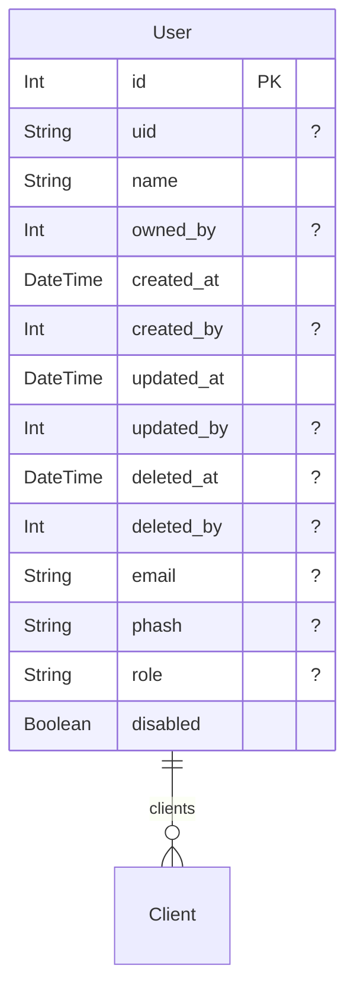
```mermaid
erDiagram
"User" {
  Int id PK 
  String uid  "?"
  String name  
  Int owned_by  "?"
  DateTime created_at  
  Int created_by  "?"
  DateTime updated_at  
  Int updated_by  "?"
  DateTime deleted_at  "?"
  Int deleted_by  "?"
  String email  "?"
  String phash  "?"
  String role  "?"
  Boolean disabled  
}

"User" ||--o{ "Client": clients

```
- CREATE
  - ✅ auth().role == 'ADMIN' || auth().role == 'SYSTEM'
  - ✅ auth().id == owned_by
- READ
  - ✅ auth().role == 'ADMIN' || auth().role == 'SYSTEM'
  - ✅ auth().id == owned_by
  - ✅ true
- UPDATE
  - ❌ name == 'system' && auth().name != 'system'
  - ✅ auth().role == 'ADMIN' || auth().role == 'SYSTEM'
  - ✅ auth().id == owned_by
- DELETE
  - ❌ name == 'system'
  - ✅ auth().role == 'ADMIN' || auth().role == 'SYSTEM'
  - ✅ auth().id == owned_by
## Client
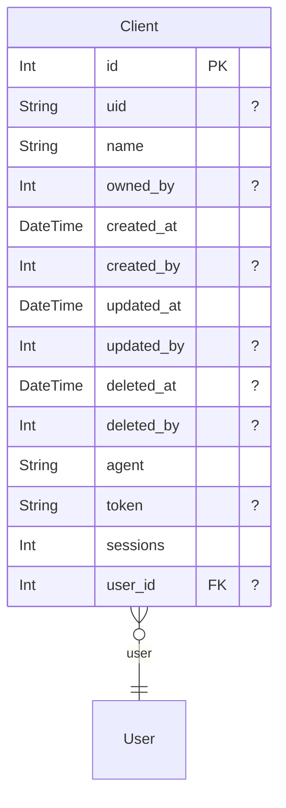
```mermaid
erDiagram
"Client" {
  Int id PK 
  String uid  "?"
  String name  
  Int owned_by  "?"
  DateTime created_at  
  Int created_by  "?"
  DateTime updated_at  
  Int updated_by  "?"
  DateTime deleted_at  "?"
  Int deleted_by  "?"
  String agent  
  String token  "?"
  Int sessions  
  Int user_id FK "?"
}

"Client" }o--|| "User": user

```
- CREATE
  - ✅ auth().role == 'ADMIN' || auth().role == 'SYSTEM'
  - ✅ auth().id == owned_by
- READ
  - ✅ auth().role == 'ADMIN' || auth().role == 'SYSTEM'
  - ✅ auth().id == owned_by
  - ✅ true
- UPDATE
  - ✅ auth().role == 'ADMIN' || auth().role == 'SYSTEM'
  - ✅ auth().id == owned_by
- DELETE
  - ✅ auth().role == 'ADMIN' || auth().role == 'SYSTEM'
  - ✅ auth().id == owned_by
## Company
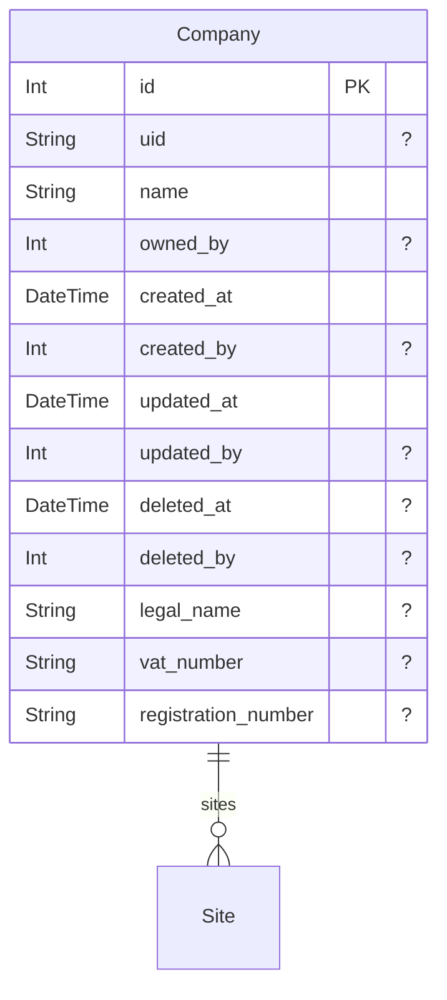
```mermaid
erDiagram
"Company" {
  Int id PK 
  String uid  "?"
  String name  
  Int owned_by  "?"
  DateTime created_at  
  Int created_by  "?"
  DateTime updated_at  
  Int updated_by  "?"
  DateTime deleted_at  "?"
  Int deleted_by  "?"
  String legal_name  "?"
  String vat_number  "?"
  String registration_number  "?"
}

"Company" ||--o{ "Site": sites

```
- CREATE
  - ✅ auth().role == 'ADMIN' || auth().role == 'SYSTEM'
  - ✅ auth().id == owned_by
- READ
  - ✅ auth().role == 'ADMIN' || auth().role == 'SYSTEM'
  - ✅ auth().id == owned_by
  - ✅ true
- UPDATE
  - ✅ auth().role == 'ADMIN' || auth().role == 'SYSTEM'
  - ✅ auth().id == owned_by
- DELETE
  - ✅ auth().role == 'ADMIN' || auth().role == 'SYSTEM'
  - ✅ auth().id == owned_by
## Site
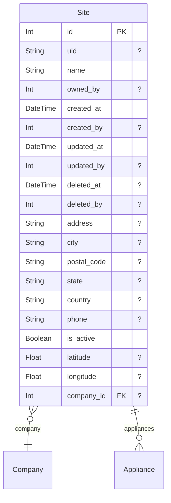
```mermaid
erDiagram
"Site" {
  Int id PK 
  String uid  "?"
  String name  
  Int owned_by  "?"
  DateTime created_at  
  Int created_by  "?"
  DateTime updated_at  
  Int updated_by  "?"
  DateTime deleted_at  "?"
  Int deleted_by  "?"
  String address  "?"
  String city  "?"
  String postal_code  "?"
  String state  "?"
  String country  "?"
  String phone  "?"
  Boolean is_active  
  Float latitude  "?"
  Float longitude  "?"
  Int company_id FK "?"
}

"Site" }o--|| "Company": company
"Site" ||--o{ "Appliance": appliances

```
- CREATE
  - ✅ auth().role == 'ADMIN' || auth().role == 'SYSTEM'
  - ✅ auth().id == owned_by
- READ
  - ✅ auth().role == 'ADMIN' || auth().role == 'SYSTEM'
  - ✅ auth().id == owned_by
  - ✅ true
- UPDATE
  - ✅ auth().role == 'ADMIN' || auth().role == 'SYSTEM'
  - ✅ auth().id == owned_by
- DELETE
  - ✅ auth().role == 'ADMIN' || auth().role == 'SYSTEM'
  - ✅ auth().id == owned_by
## Appliance
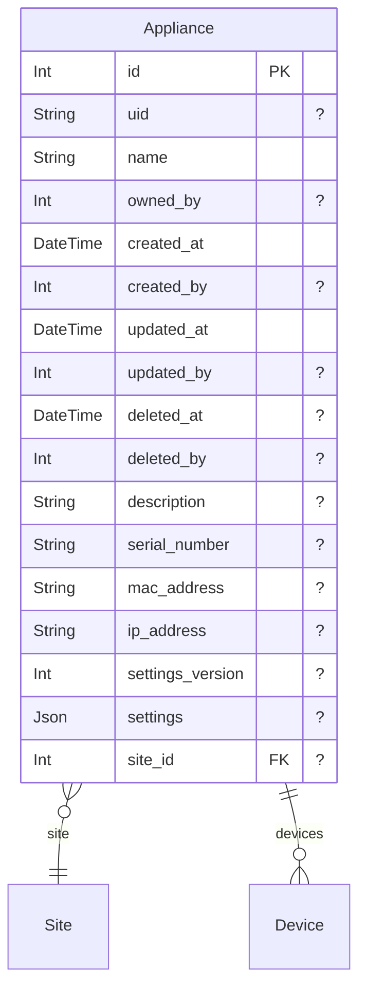
```mermaid
erDiagram
"Appliance" {
  Int id PK 
  String uid  "?"
  String name  
  Int owned_by  "?"
  DateTime created_at  
  Int created_by  "?"
  DateTime updated_at  
  Int updated_by  "?"
  DateTime deleted_at  "?"
  Int deleted_by  "?"
  String description  "?"
  String serial_number  "?"
  String mac_address  "?"
  String ip_address  "?"
  Int settings_version  "?"
  Json settings  "?"
  Int site_id FK "?"
}

"Appliance" }o--|| "Site": site
"Appliance" ||--o{ "Device": devices

```
- CREATE
  - ✅ auth().role == 'ADMIN' || auth().role == 'SYSTEM'
  - ✅ auth().id == owned_by
- READ
  - ✅ auth().role == 'ADMIN' || auth().role == 'SYSTEM'
  - ✅ auth().id == owned_by
  - ✅ true
- UPDATE
  - ✅ auth().role == 'ADMIN' || auth().role == 'SYSTEM'
  - ✅ auth().id == owned_by
- DELETE
  - ✅ auth().role == 'ADMIN' || auth().role == 'SYSTEM'
  - ✅ auth().id == owned_by
## SettingsHistory
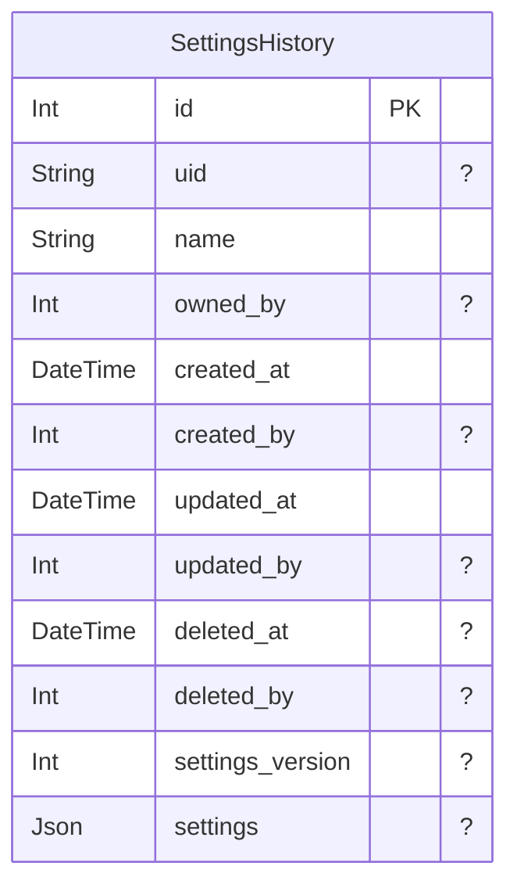
```mermaid
erDiagram
"SettingsHistory" {
  Int id PK 
  String uid  "?"
  String name  
  Int owned_by  "?"
  DateTime created_at  
  Int created_by  "?"
  DateTime updated_at  
  Int updated_by  "?"
  DateTime deleted_at  "?"
  Int deleted_by  "?"
  Int settings_version  "?"
  Json settings  "?"
}


```
- CREATE
  - ✅ auth().role == 'ADMIN' || auth().role == 'SYSTEM'
  - ✅ auth().id == owned_by
- READ
  - ✅ auth().role == 'ADMIN' || auth().role == 'SYSTEM'
  - ✅ auth().id == owned_by
  - ✅ true
- UPDATE
  - ✅ auth().role == 'ADMIN' || auth().role == 'SYSTEM'
  - ✅ auth().id == owned_by
- DELETE
  - ✅ auth().role == 'ADMIN' || auth().role == 'SYSTEM'
  - ✅ auth().id == owned_by
## Vendor
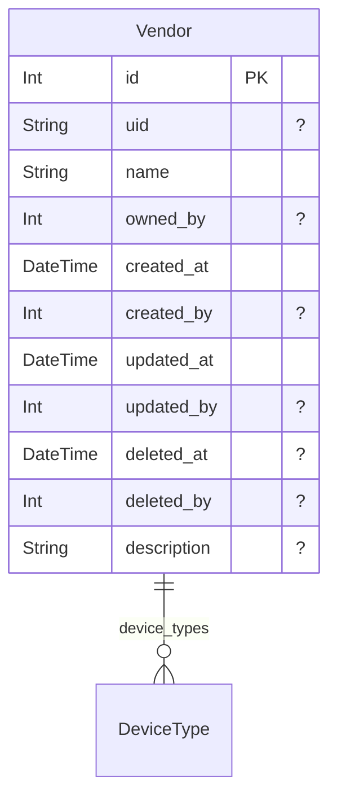
```mermaid
erDiagram
"Vendor" {
  Int id PK 
  String uid  "?"
  String name  
  Int owned_by  "?"
  DateTime created_at  
  Int created_by  "?"
  DateTime updated_at  
  Int updated_by  "?"
  DateTime deleted_at  "?"
  Int deleted_by  "?"
  String description  "?"
}

"Vendor" ||--o{ "DeviceType": device_types

```
- CREATE
  - ✅ auth().role == 'ADMIN' || auth().role == 'SYSTEM'
  - ✅ auth().id == owned_by
- READ
  - ✅ auth().role == 'ADMIN' || auth().role == 'SYSTEM'
  - ✅ auth().id == owned_by
  - ✅ true
- UPDATE
  - ✅ auth().role == 'ADMIN' || auth().role == 'SYSTEM'
  - ✅ auth().id == owned_by
- DELETE
  - ✅ auth().role == 'ADMIN' || auth().role == 'SYSTEM'
  - ✅ auth().id == owned_by
## Category
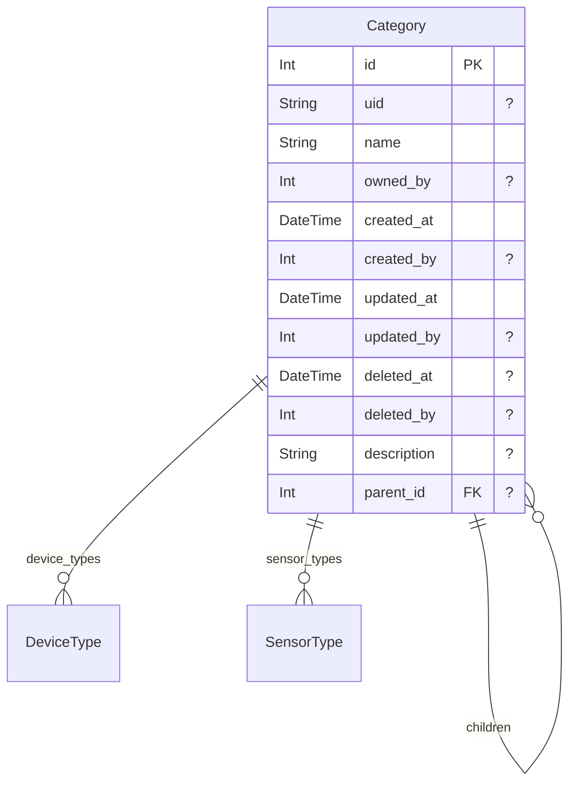
```mermaid
erDiagram
"Category" {
  Int id PK 
  String uid  "?"
  String name  
  Int owned_by  "?"
  DateTime created_at  
  Int created_by  "?"
  DateTime updated_at  
  Int updated_by  "?"
  DateTime deleted_at  "?"
  Int deleted_by  "?"
  String description  "?"
  Int parent_id FK "?"
}

"Category" ||--o| "Category": parent
"Category" ||--o{ "Category": children
"Category" ||--o{ "DeviceType": device_types
"Category" ||--o{ "SensorType": sensor_types

```
- CREATE
  - ✅ auth().role == 'ADMIN' || auth().role == 'SYSTEM'
  - ✅ auth().id == owned_by
- READ
  - ✅ auth().role == 'ADMIN' || auth().role == 'SYSTEM'
  - ✅ auth().id == owned_by
  - ✅ true
- UPDATE
  - ✅ auth().role == 'ADMIN' || auth().role == 'SYSTEM'
  - ✅ auth().id == owned_by
- DELETE
  - ✅ auth().role == 'ADMIN' || auth().role == 'SYSTEM'
  - ✅ auth().id == owned_by
## DeviceType
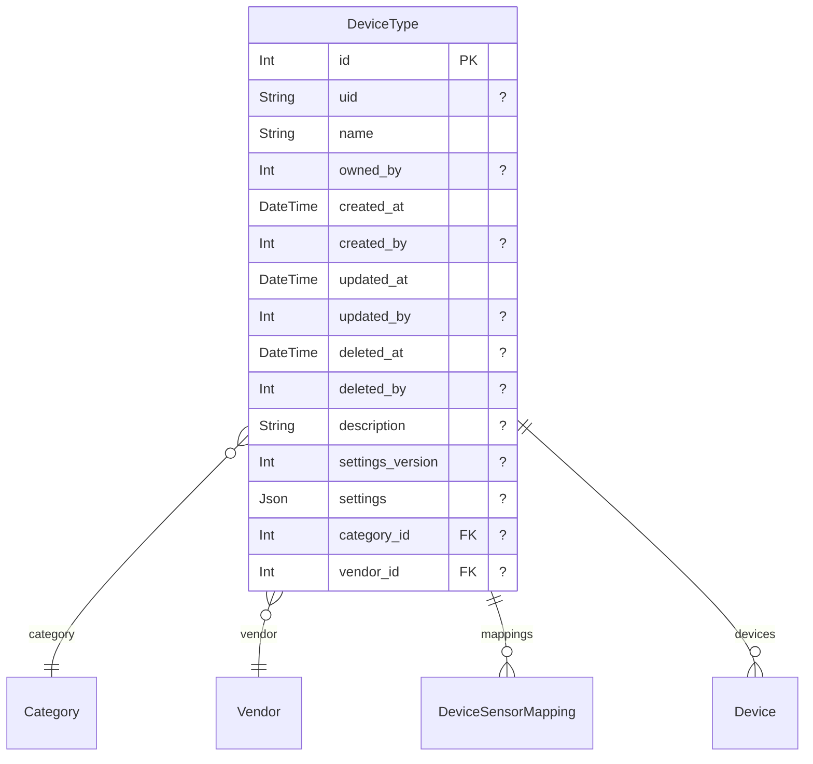
```mermaid
erDiagram
"DeviceType" {
  Int id PK 
  String uid  "?"
  String name  
  Int owned_by  "?"
  DateTime created_at  
  Int created_by  "?"
  DateTime updated_at  
  Int updated_by  "?"
  DateTime deleted_at  "?"
  Int deleted_by  "?"
  String description  "?"
  Int settings_version  "?"
  Json settings  "?"
  Int category_id FK "?"
  Int vendor_id FK "?"
}

"DeviceType" }o--|| "Category": category
"DeviceType" }o--|| "Vendor": vendor
"DeviceType" ||--o{ "DeviceSensorMapping": mappings
"DeviceType" ||--o{ "Device": devices

```
- CREATE
  - ✅ auth().role == 'ADMIN' || auth().role == 'SYSTEM'
  - ✅ auth().id == owned_by
- READ
  - ✅ auth().role == 'ADMIN' || auth().role == 'SYSTEM'
  - ✅ auth().id == owned_by
  - ✅ true
- UPDATE
  - ✅ auth().role == 'ADMIN' || auth().role == 'SYSTEM'
  - ✅ auth().id == owned_by
- DELETE
  - ✅ auth().role == 'ADMIN' || auth().role == 'SYSTEM'
  - ✅ auth().id == owned_by
## SensorType
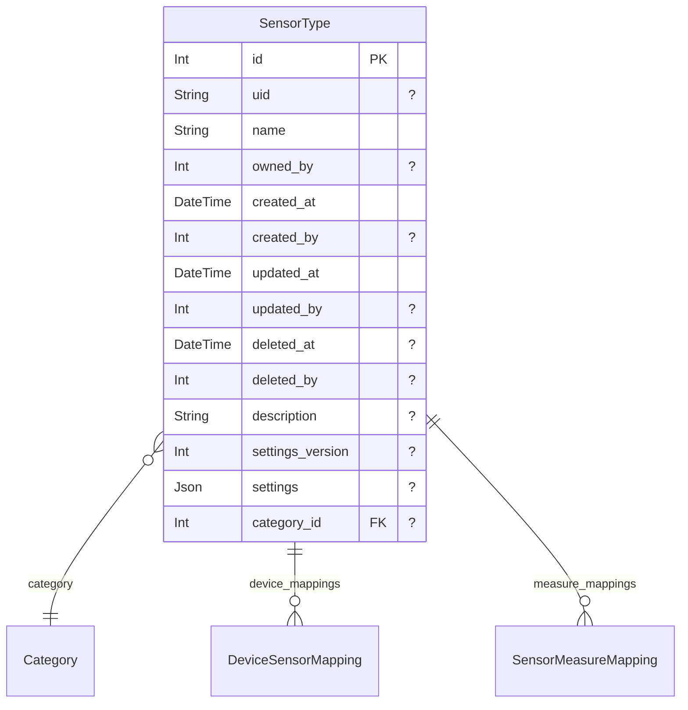
```mermaid
erDiagram
"SensorType" {
  Int id PK 
  String uid  "?"
  String name  
  Int owned_by  "?"
  DateTime created_at  
  Int created_by  "?"
  DateTime updated_at  
  Int updated_by  "?"
  DateTime deleted_at  "?"
  Int deleted_by  "?"
  String description  "?"
  Int settings_version  "?"
  Json settings  "?"
  Int category_id FK "?"
}

"SensorType" }o--|| "Category": category
"SensorType" ||--o{ "DeviceSensorMapping": device_mappings
"SensorType" ||--o{ "SensorMeasureMapping": measure_mappings

```
- CREATE
  - ✅ auth().role == 'ADMIN' || auth().role == 'SYSTEM'
  - ✅ auth().id == owned_by
- READ
  - ✅ auth().role == 'ADMIN' || auth().role == 'SYSTEM'
  - ✅ auth().id == owned_by
  - ✅ true
- UPDATE
  - ✅ auth().role == 'ADMIN' || auth().role == 'SYSTEM'
  - ✅ auth().id == owned_by
- DELETE
  - ✅ auth().role == 'ADMIN' || auth().role == 'SYSTEM'
  - ✅ auth().id == owned_by
## DeviceSensorMapping
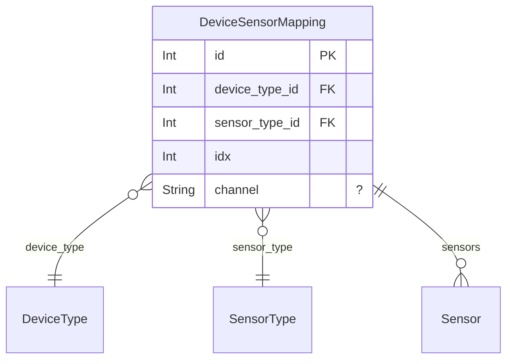
```mermaid
erDiagram
"DeviceSensorMapping" {
  Int id PK 
  Int device_type_id FK 
  Int sensor_type_id FK 
  Int idx  
  String channel  "?"
}

"DeviceSensorMapping" }o--|| "DeviceType": device_type
"DeviceSensorMapping" }o--|| "SensorType": sensor_type
"DeviceSensorMapping" ||--o{ "Sensor": sensors

```
- CREATE

- READ

- UPDATE

- DELETE

## Device
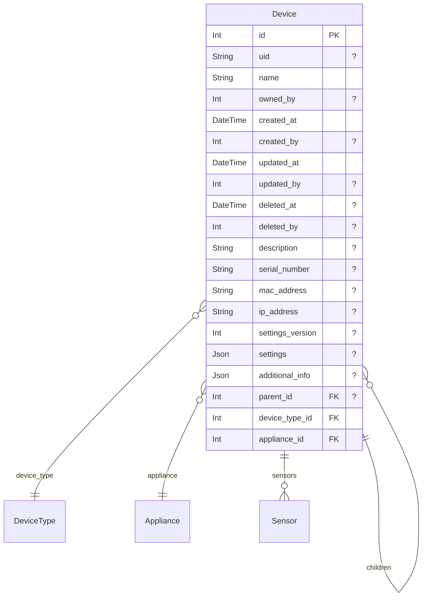
```mermaid
erDiagram
"Device" {
  Int id PK 
  String uid  "?"
  String name  
  Int owned_by  "?"
  DateTime created_at  
  Int created_by  "?"
  DateTime updated_at  
  Int updated_by  "?"
  DateTime deleted_at  "?"
  Int deleted_by  "?"
  String description  "?"
  String serial_number  "?"
  String mac_address  "?"
  String ip_address  "?"
  Int settings_version  "?"
  Json settings  "?"
  Json additional_info  "?"
  Int parent_id FK "?"
  Int device_type_id FK 
  Int appliance_id FK 
}

"Device" ||--o| "Device": parent
"Device" ||--o{ "Device": children
"Device" }o--|| "DeviceType": device_type
"Device" }o--|| "Appliance": appliance
"Device" ||--o{ "Sensor": sensors

```
- CREATE
  - ✅ auth().role == 'ADMIN' || auth().role == 'SYSTEM'
  - ✅ auth().id == owned_by
- READ
  - ✅ auth().role == 'ADMIN' || auth().role == 'SYSTEM'
  - ✅ auth().id == owned_by
  - ✅ true
- UPDATE
  - ✅ auth().role == 'ADMIN' || auth().role == 'SYSTEM'
  - ✅ auth().id == owned_by
- DELETE
  - ✅ auth().role == 'ADMIN' || auth().role == 'SYSTEM'
  - ✅ auth().id == owned_by
## Sensor
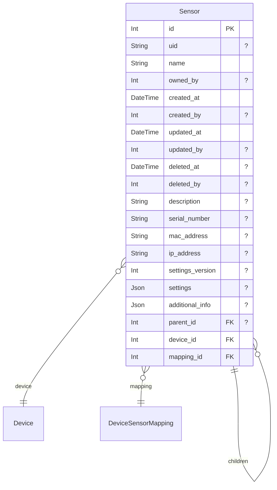
```mermaid
erDiagram
"Sensor" {
  Int id PK 
  String uid  "?"
  String name  
  Int owned_by  "?"
  DateTime created_at  
  Int created_by  "?"
  DateTime updated_at  
  Int updated_by  "?"
  DateTime deleted_at  "?"
  Int deleted_by  "?"
  String description  "?"
  String serial_number  "?"
  String mac_address  "?"
  String ip_address  "?"
  Int settings_version  "?"
  Json settings  "?"
  Json additional_info  "?"
  Int parent_id FK "?"
  Int device_id FK 
  Int mapping_id FK 
}

"Sensor" ||--o| "Sensor": parent
"Sensor" ||--o{ "Sensor": children
"Sensor" }o--|| "Device": device
"Sensor" }o--|| "DeviceSensorMapping": mapping

```
- CREATE
  - ✅ auth().role == 'ADMIN' || auth().role == 'SYSTEM'
  - ✅ auth().id == owned_by
- READ
  - ✅ auth().role == 'ADMIN' || auth().role == 'SYSTEM'
  - ✅ auth().id == owned_by
  - ✅ true
- UPDATE
  - ✅ auth().role == 'ADMIN' || auth().role == 'SYSTEM'
  - ✅ auth().id == owned_by
- DELETE
  - ✅ auth().role == 'ADMIN' || auth().role == 'SYSTEM'
  - ✅ auth().id == owned_by
## MeasureType
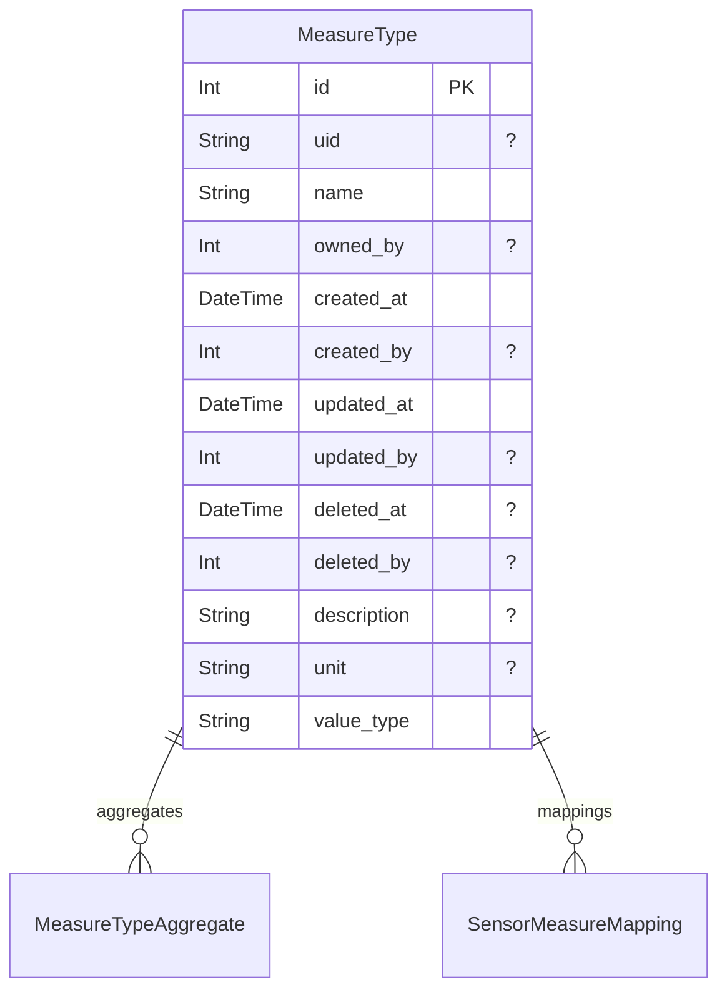
```mermaid
erDiagram
"MeasureType" {
  Int id PK 
  String uid  "?"
  String name  
  Int owned_by  "?"
  DateTime created_at  
  Int created_by  "?"
  DateTime updated_at  
  Int updated_by  "?"
  DateTime deleted_at  "?"
  Int deleted_by  "?"
  String description  "?"
  String unit  "?"
  String value_type  
}

"MeasureType" ||--o{ "MeasureTypeAggregate": aggregates
"MeasureType" ||--o{ "SensorMeasureMapping": mappings

```
- CREATE
  - ✅ auth().role == 'ADMIN' || auth().role == 'SYSTEM'
  - ✅ auth().id == owned_by
- READ
  - ✅ auth().role == 'ADMIN' || auth().role == 'SYSTEM'
  - ✅ auth().id == owned_by
  - ✅ true
- UPDATE
  - ✅ auth().role == 'ADMIN' || auth().role == 'SYSTEM'
  - ✅ auth().id == owned_by
- DELETE
  - ✅ auth().role == 'ADMIN' || auth().role == 'SYSTEM'
  - ✅ auth().id == owned_by
## MeasureTypeAggregate
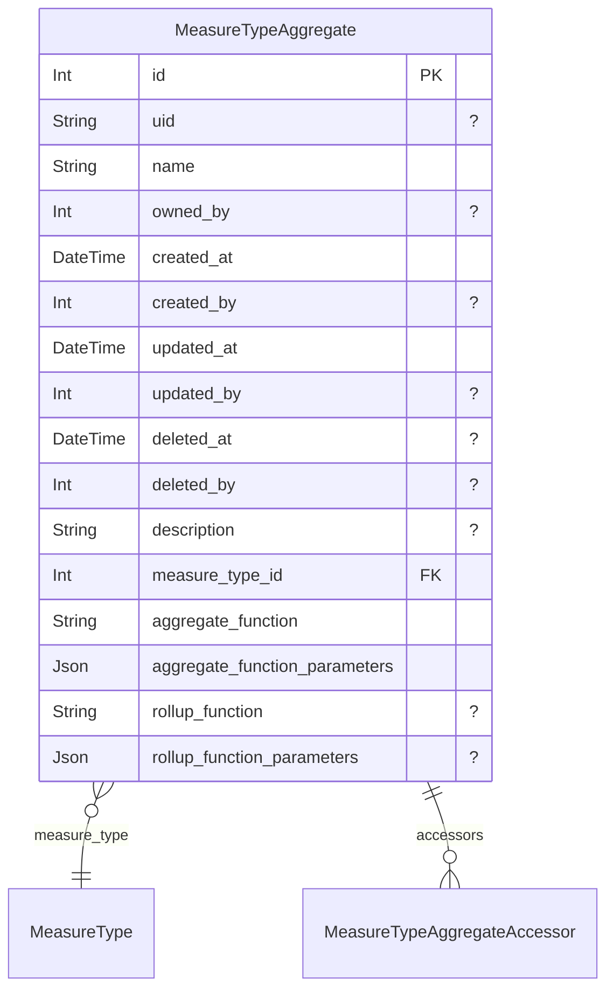
```mermaid
erDiagram
"MeasureTypeAggregate" {
  Int id PK 
  String uid  "?"
  String name  
  Int owned_by  "?"
  DateTime created_at  
  Int created_by  "?"
  DateTime updated_at  
  Int updated_by  "?"
  DateTime deleted_at  "?"
  Int deleted_by  "?"
  String description  "?"
  Int measure_type_id FK 
  String aggregate_function  
  Json aggregate_function_parameters  
  String rollup_function  "?"
  Json rollup_function_parameters  "?"
}

"MeasureTypeAggregate" }o--|| "MeasureType": measure_type
"MeasureTypeAggregate" ||--o{ "MeasureTypeAggregateAccessor": accessors

```
- CREATE
  - ✅ auth().role == 'ADMIN' || auth().role == 'SYSTEM'
  - ✅ auth().id == owned_by
- READ
  - ✅ auth().role == 'ADMIN' || auth().role == 'SYSTEM'
  - ✅ auth().id == owned_by
  - ✅ true
- UPDATE
  - ✅ auth().role == 'ADMIN' || auth().role == 'SYSTEM'
  - ✅ auth().id == owned_by
- DELETE
  - ✅ auth().role == 'ADMIN' || auth().role == 'SYSTEM'
  - ✅ auth().id == owned_by
## MeasureTypeAggregateAccessor
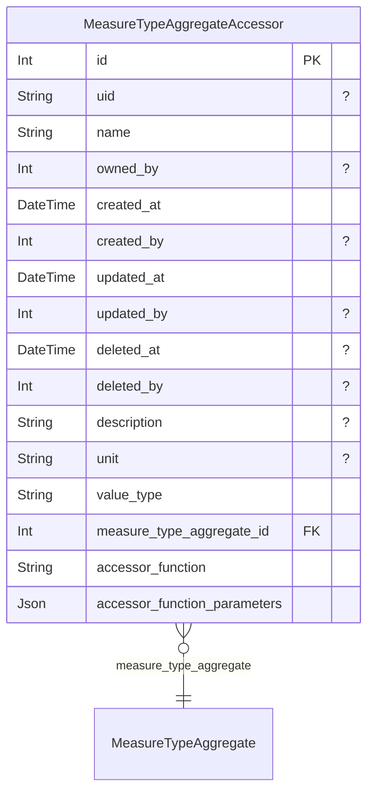
```mermaid
erDiagram
"MeasureTypeAggregateAccessor" {
  Int id PK 
  String uid  "?"
  String name  
  Int owned_by  "?"
  DateTime created_at  
  Int created_by  "?"
  DateTime updated_at  
  Int updated_by  "?"
  DateTime deleted_at  "?"
  Int deleted_by  "?"
  String description  "?"
  String unit  "?"
  String value_type  
  Int measure_type_aggregate_id FK 
  String accessor_function  
  Json accessor_function_parameters  
}

"MeasureTypeAggregateAccessor" }o--|| "MeasureTypeAggregate": measure_type_aggregate

```
- CREATE
  - ✅ auth().role == 'ADMIN' || auth().role == 'SYSTEM'
  - ✅ auth().id == owned_by
- READ
  - ✅ auth().role == 'ADMIN' || auth().role == 'SYSTEM'
  - ✅ auth().id == owned_by
  - ✅ true
- UPDATE
  - ✅ auth().role == 'ADMIN' || auth().role == 'SYSTEM'
  - ✅ auth().id == owned_by
- DELETE
  - ✅ auth().role == 'ADMIN' || auth().role == 'SYSTEM'
  - ✅ auth().id == owned_by
## DefaultValueTypeAggregate
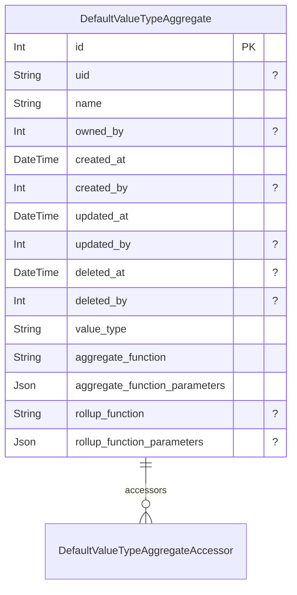
```mermaid
erDiagram
"DefaultValueTypeAggregate" {
  Int id PK 
  String uid  "?"
  String name  
  Int owned_by  "?"
  DateTime created_at  
  Int created_by  "?"
  DateTime updated_at  
  Int updated_by  "?"
  DateTime deleted_at  "?"
  Int deleted_by  "?"
  String value_type  
  String aggregate_function  
  Json aggregate_function_parameters  
  String rollup_function  "?"
  Json rollup_function_parameters  "?"
}

"DefaultValueTypeAggregate" ||--o{ "DefaultValueTypeAggregateAccessor": accessors

```
- CREATE
  - ✅ auth().role == 'ADMIN' || auth().role == 'SYSTEM'
  - ✅ auth().id == owned_by
- READ
  - ✅ auth().role == 'ADMIN' || auth().role == 'SYSTEM'
  - ✅ auth().id == owned_by
  - ✅ true
- UPDATE
  - ✅ auth().role == 'ADMIN' || auth().role == 'SYSTEM'
  - ✅ auth().id == owned_by
- DELETE
  - ✅ auth().role == 'ADMIN' || auth().role == 'SYSTEM'
  - ✅ auth().id == owned_by
## DefaultValueTypeAggregateAccessor
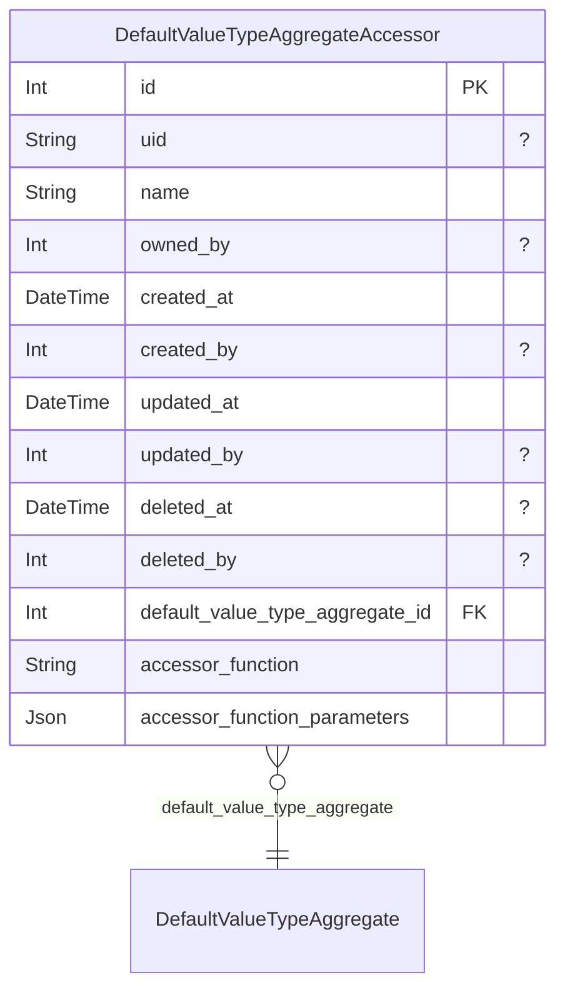
```mermaid
erDiagram
"DefaultValueTypeAggregateAccessor" {
  Int id PK 
  String uid  "?"
  String name  
  Int owned_by  "?"
  DateTime created_at  
  Int created_by  "?"
  DateTime updated_at  
  Int updated_by  "?"
  DateTime deleted_at  "?"
  Int deleted_by  "?"
  Int default_value_type_aggregate_id FK 
  String accessor_function  
  Json accessor_function_parameters  
}

"DefaultValueTypeAggregateAccessor" }o--|| "DefaultValueTypeAggregate": default_value_type_aggregate

```
- CREATE
  - ✅ auth().role == 'ADMIN' || auth().role == 'SYSTEM'
  - ✅ auth().id == owned_by
- READ
  - ✅ auth().role == 'ADMIN' || auth().role == 'SYSTEM'
  - ✅ auth().id == owned_by
  - ✅ true
- UPDATE
  - ✅ auth().role == 'ADMIN' || auth().role == 'SYSTEM'
  - ✅ auth().id == owned_by
- DELETE
  - ✅ auth().role == 'ADMIN' || auth().role == 'SYSTEM'
  - ✅ auth().id == owned_by
## SensorMeasureMapping
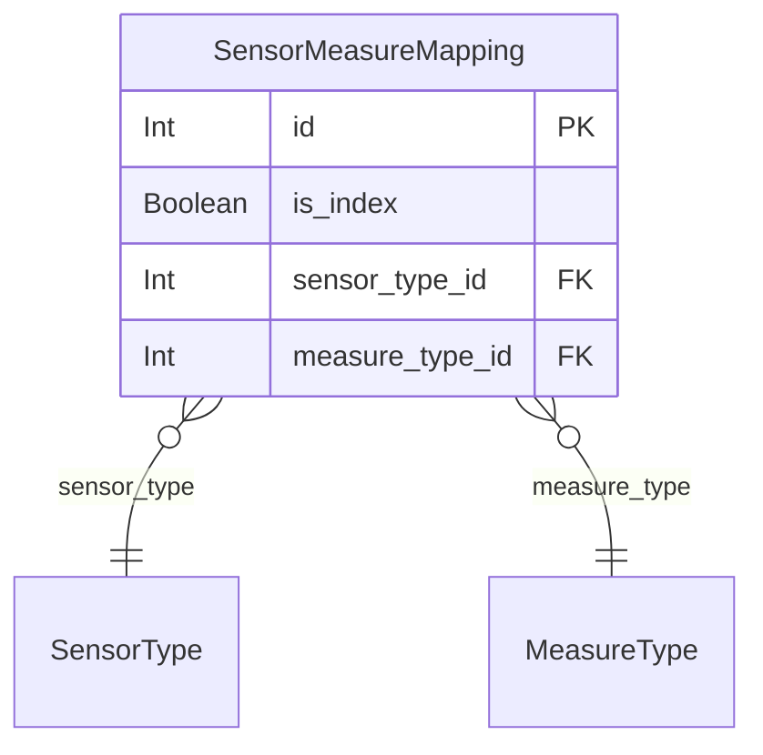
```mermaid
erDiagram
"SensorMeasureMapping" {
  Int id PK 
  Boolean is_index  
  Int sensor_type_id FK 
  Int measure_type_id FK 
}

"SensorMeasureMapping" }o--|| "SensorType": sensor_type
"SensorMeasureMapping" }o--|| "MeasureType": measure_type

```
- CREATE

- READ

- UPDATE

- DELETE

## Measure
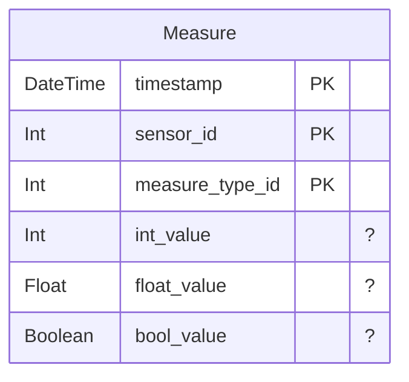
```mermaid
erDiagram
"Measure" {
  DateTime timestamp PK 
  Int sensor_id PK 
  Int measure_type_id PK 
  Int int_value  "?"
  Float float_value  "?"
  Boolean bool_value  "?"
}


```
- CREATE

- READ

- UPDATE

- DELETE
